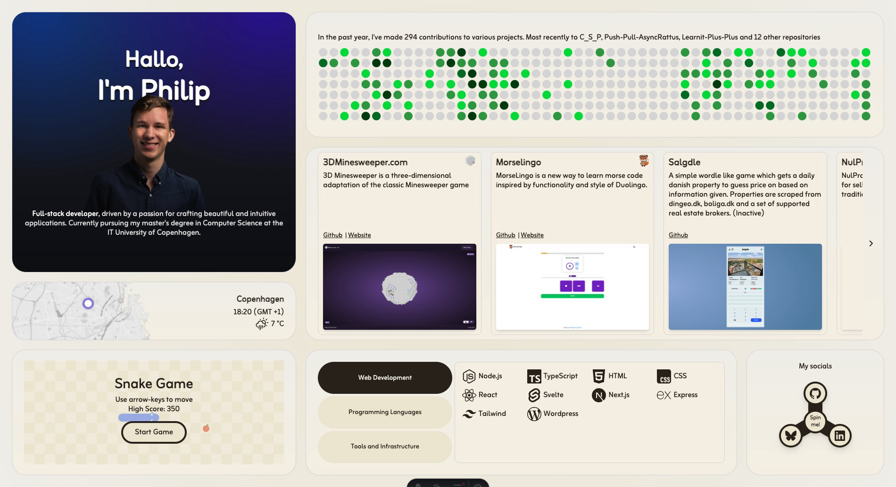

# Philip Flyvholm's Portfolio

This is a portfolio website for myself created with Astro and Svelte.

Visit it live on [PhilipFlyvholm.com](https://philipflyvholm.com)

## Installation

1. Clone the repository.
2. Run `npm install` to install the dependencies.
3. Run `npm run dev` to start the development server.

## Deployment

1. Run `npm run build` to build the production-ready files.
2. Deploy the contents of the `dist` directory to your hosting provider.
